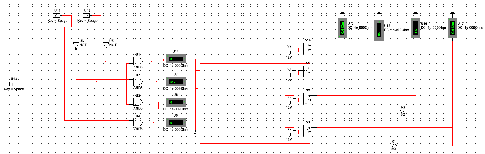
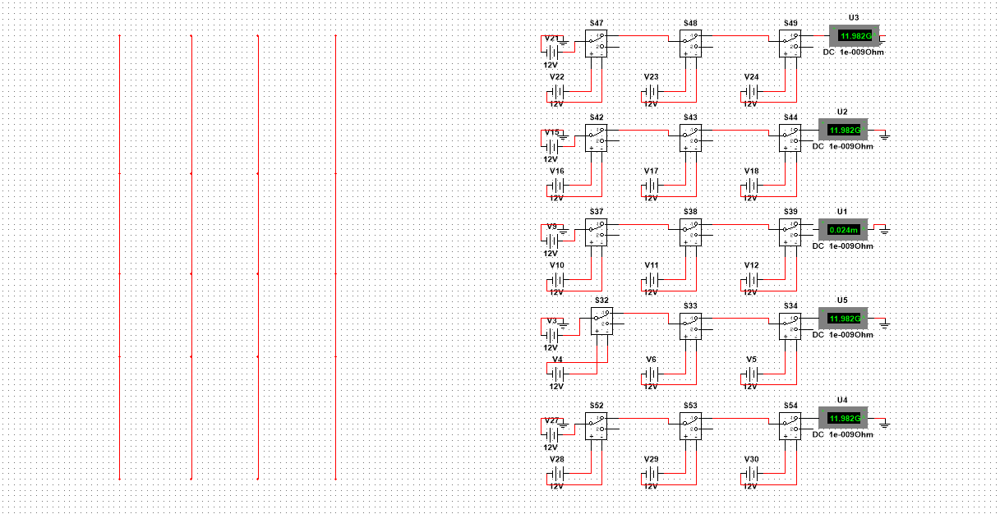
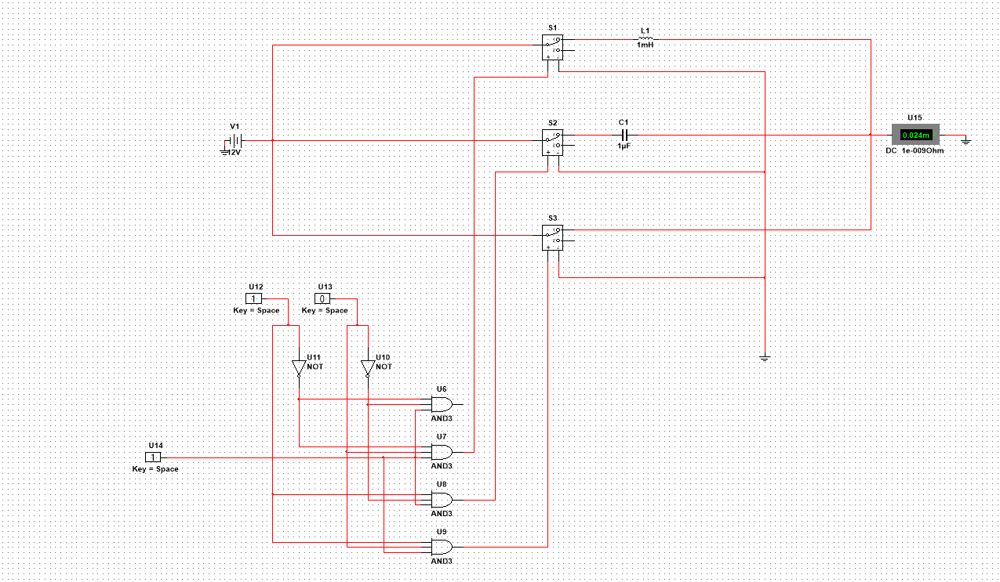

# HackX Project Submission

## Team Name - ALA

## Team Members

 - Nuthakki Shiv Thomas (9176075073) 
 - Anshuman Phadke (9527351165)
 - Nithesh C (6385185864)
 - S P Mihir Achyuta (7702334357)

## Track - Open Innovation

## Powerpoint 

https://docs.google.com/presentation/d/12Tac9owxAcGfSlSnIKjkG0-CamH6buSRNrdLzEX-q_Q/edit?usp=sharing

## Breadboard Deduction Circuit

  
 

 
 ## Array of Switches in Lab
 

  
 

 
 ## Demux circuit for choosing component
 

  
 

